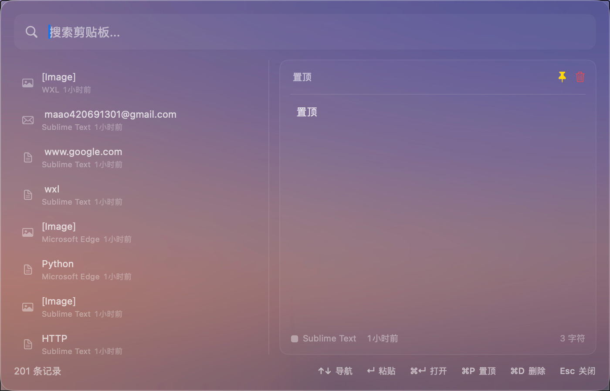
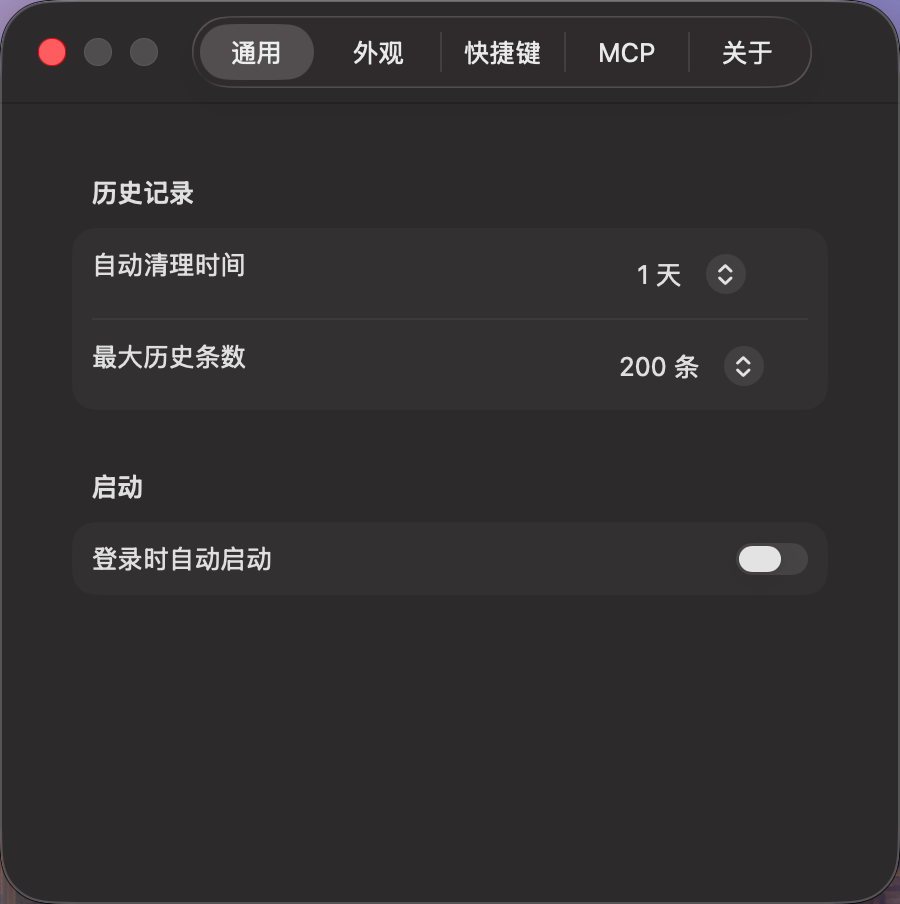

# WXL - macOS 剪贴板历史管理器

<p align="center">
  
  
  
</p>

<p align="center">
  一款基于 <strong>Liquid Glass UI</strong> 的 macOS 剪贴板历史管理工具。
</p>

<p align="center">
  
  <br>
  
</p>

## 功能

- **剪贴板历史** — 自动记录文本、图片、文件
- **智能识别** — URL、邮箱、电话、文件路径自动检测，一键执行对应操作
- **实时搜索** — 即时过滤历史记录
- **置顶收藏** — 重要内容置顶保存，永不自动清理
- **自动清理** — 可配置保留时间与最大条数
- **来源追踪** — 记录每条内容的来源应用
- **MCP 集成** — 内置 MCP 服务器，支持 Claude Code 等 AI 工具访问剪贴板历史

## 快捷键

| 快捷键 | 功能 |
|-------|------|
| `⌘⇧C` | 显示/隐藏面板（可自定义） |
| `↑` / `↓` | 选择项目 |
| `Enter` | 复制到剪贴板 |
| `⌘↵` | 智能动作（打开 URL / 显示文件 / 发邮件等） |
| `⌘P` | 置顶/取消置顶 |
| `⌘D` | 删除 |
| `Esc` | 关闭面板 |

## 安装

从 [Releases](https://github.com/maaoBit/wxl/releases) 下载最新版 `.app`，拖入 `/Applications` 即可。

或从源码构建：

```bash
git clone https://github.com/maaoBit/wxl.git
cd wxl
swift build -c release
```

## MCP 集成

WXL 内置 MCP 服务器，允许 AI 工具访问剪贴板历史。应用启动后自动运行在 `http://127.0.0.1:9527`。

在 Claude Code 中配置：

```bash
claude mcp add --transport http wxl http://127.0.0.1:9527/mcp
```

可用工具：`get_clipboard_history` · `search_clipboard` · `generate_note`

测试连接：

```bash
curl http://127.0.0.1:9527/health
```

## 系统要求

- macOS 14.0 (Sonoma) 及以上
- Apple Silicon 或 Intel

## 许可证

[MIT](LICENSE)
